## OSI参考模型（Open System Interconnection）

--不同的计算机网络使用了不同标准不能互联，为了统一网络标准，让不同的计算机网络互联

--将网络分为七层，将复杂流程分解，调整时对上下层影响较小。

--**物理层 数据链路层 网络层 传输层** 会话层 表示层 应用层

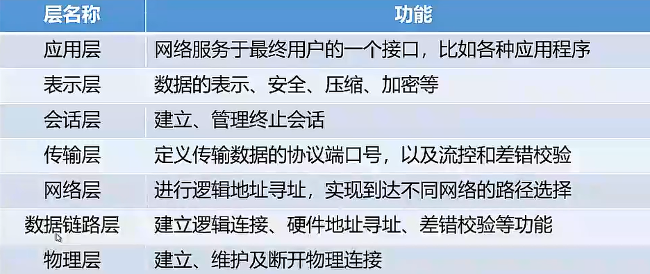

注：逻辑地址可变，硬件地址**唯一**不可变

物理层：--用物理信号表示数据1和0   --传输方向  --通信双方如何建立中止连接，物理接口特性

数据链路层：--数据帧的封装结构  --源和目的方向的硬件地址 数据校验功能

网络层：--数据包的封装结构 --源地址目标地址的逻辑地址 --依据包头的逻辑地址选路

传输层：--用户进程间的通信 --承上启下

会话层：建立用户间的会话关系

表示层：定义传递信息的语法语义  --编码和解码 压缩和解压缩 加密和解密

应用层：提供与用户的接口

**使用科来网络分析系统**  抓取物理网卡数据包并进行分析

## TCP/IP模型

--是一系列的协议集合，严格来讲是TCP/IP协议族

-**-物理层和数据链路层**TCP/IP未定义任何特定协议

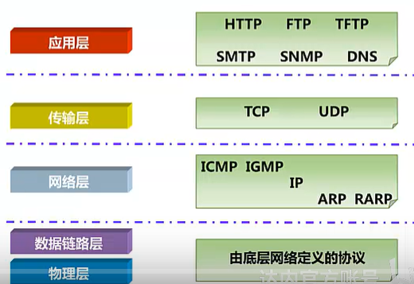

--**网络层**

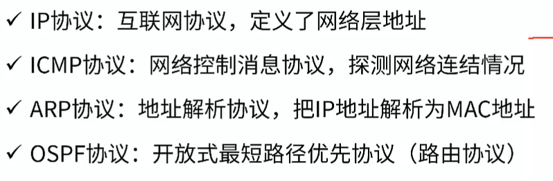

注：ARP地址解析协议 举例，快递邮寄给张三，但是叫张三的人有很多，需要知道其对应的唯一家庭住址即可配送

--**传输层**

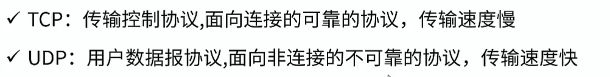

--**应用层**

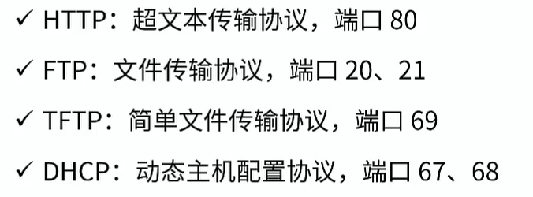

注：抓取TCP/IP模型各层数据包

## 数据封装与解封装

数据在每一层都有对应的名称以及对应的设备

--PDU 协议数据单元  Protocol Data Unit

|            | 数据名称 | 对应设备       |
| ---------- | -------- | -------------- |
| 应用层     | 上层数据 | 计算机各种软件 |
| 传输层     | 数据段   | 防火墙         |
| 网络层     | 数据包   | 路由器         |
| 数据链路层 | 数据帧   | 交换机         |
| 物理层     | 比特流   | 网卡           |

### 封装

--发送数据，每经过一层，从上层到下层，加上头部信息或者尾部信息

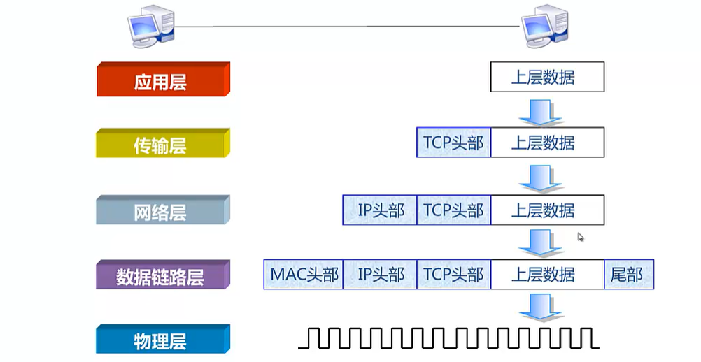

### 解封装

--传送到目的主机后向上层解封装

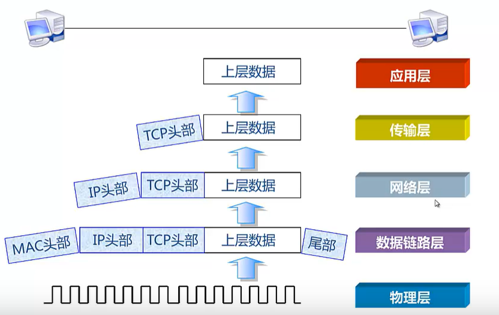

--设备与设备的通信实际上是相同层次的通信，相同层次只能检查相同层次封装的头部信息

### 各层间的通信

--**通信是相互的**   封装  传输 解封装 

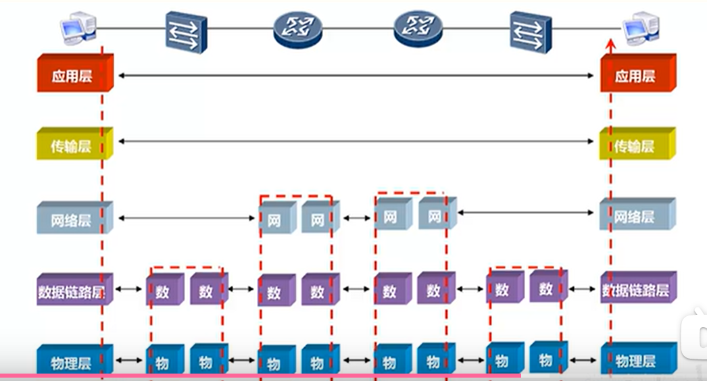

注：ping www.baidu.com   ping 使用的是ICMP协议，会发现源地址和目标地址刚好相反，一去一回

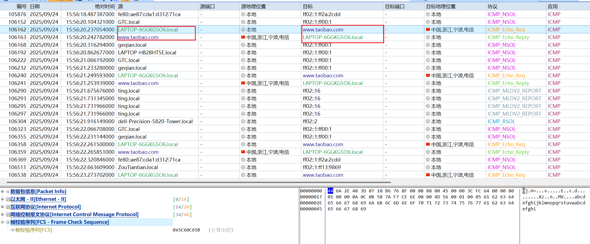

注：自上向下第一层第二层第三层第四层

## IP地址

### 概述

--任何联网的设备都必须有IP地址，一个地址只能给一个设备使用

--IP地址长度为32bit，网络号+主机号，掩码长度与IP地址长度相同，同为32bit

--表示 二进制 点分十进制 192.168.1.1/24（前24为网络位）

--**掩码**区分IP地址中的网络位和主机位，1对应网络位 0对应主机位，IP地址和掩码同时出现

--IP地址分类  依据第一个字节十进制范围，若没有给出掩码则是默认掩码

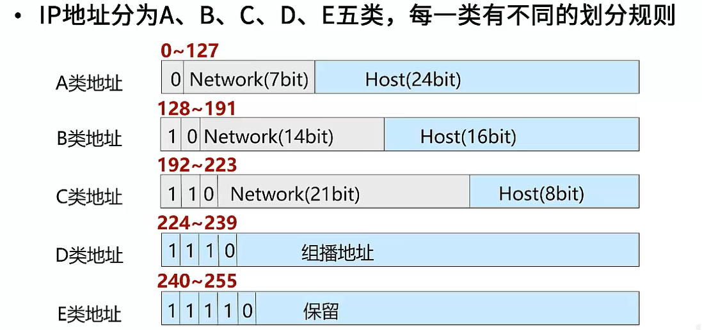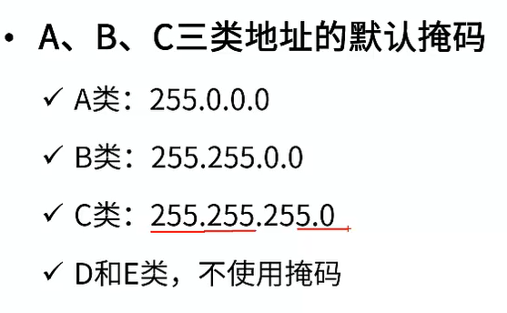

注：两主机能ping通，需要保持其有相同的网络号

### 特殊IP地址

--**背景问题**  1.IP地址空间不足  2.IP地址浪费（网段中有空闲的IP地址）

--**解决方法** 私有地址和公有地址（与ABC类地址不冲突，ABC类地址中可包含私有公有地址）   子网划分

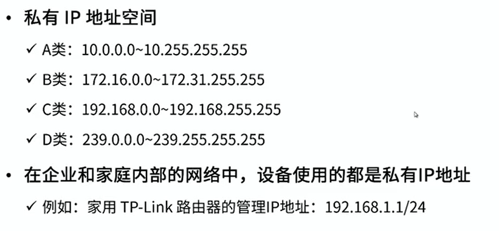

--**网络地址** 表示是一个网络范围仅仅表示一个区域，主机位全为0

--**广播地址** 表示一个网络范围内的所有主机设备 ，主机位全为1

--**可用IP地址** 除了网络地址和网络地址（除了主机号全为0和全为1）在网络中唯一的标识一个主机

--**其他特殊地址** 

127.0.0.0-127.255.255.255 表示设备本身（ping 127.0.0.1能ping通说明，网卡能发包收包，网卡没有问题）

255.255.255.255 表示网段内所有主机

0.0.0.0 表示所有网段

